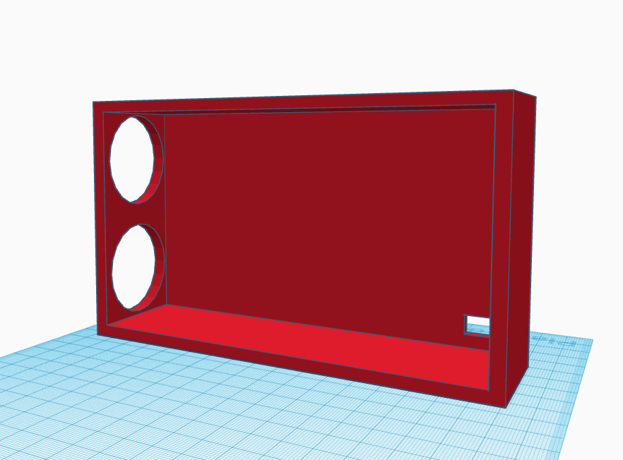
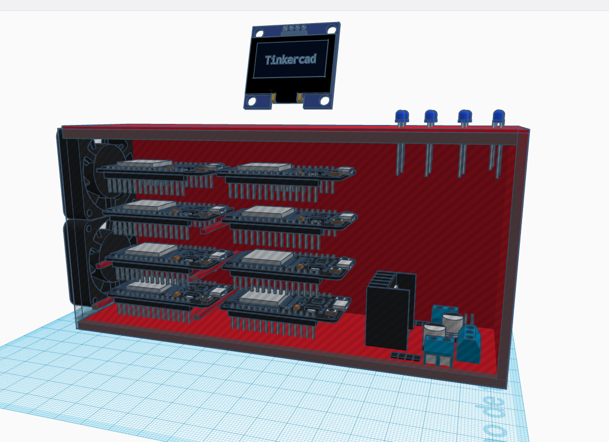
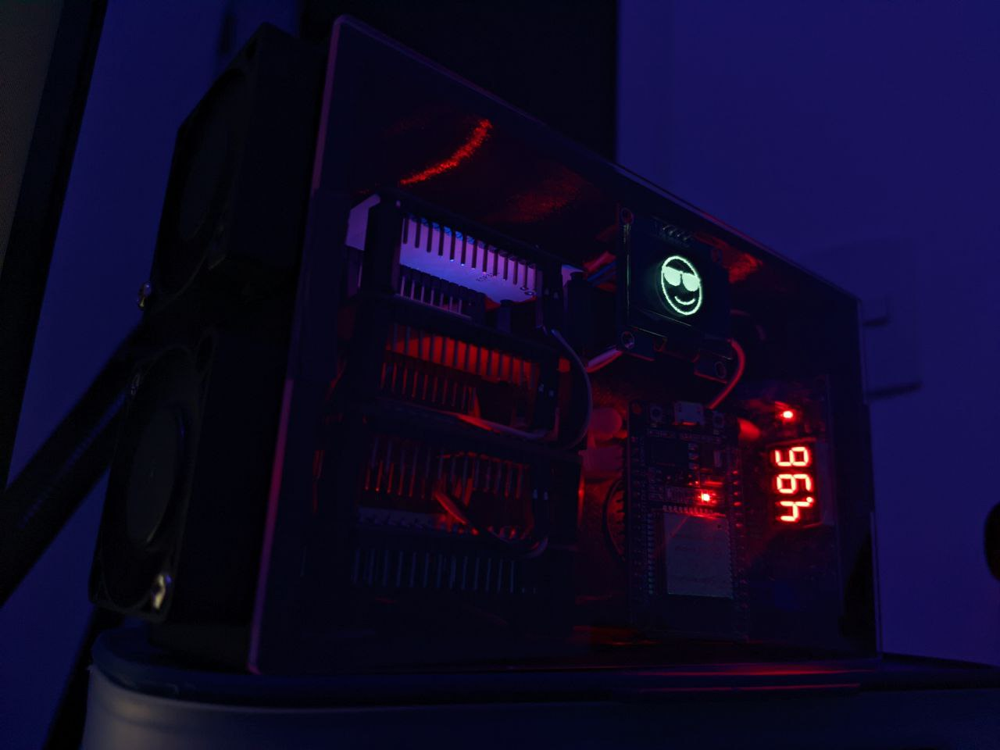
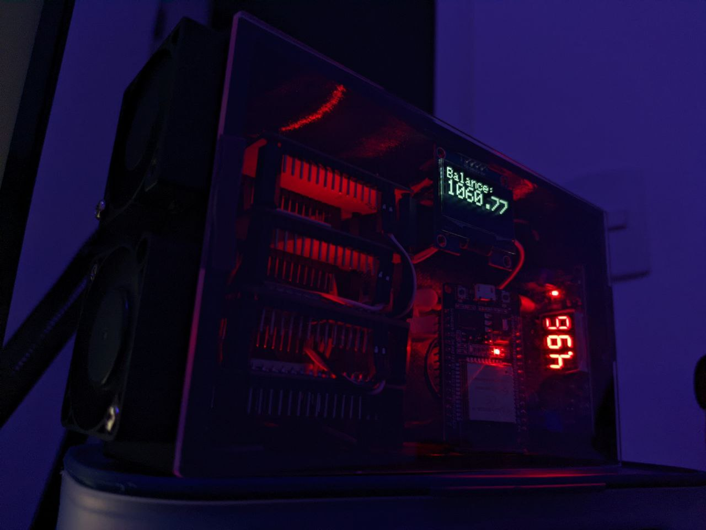
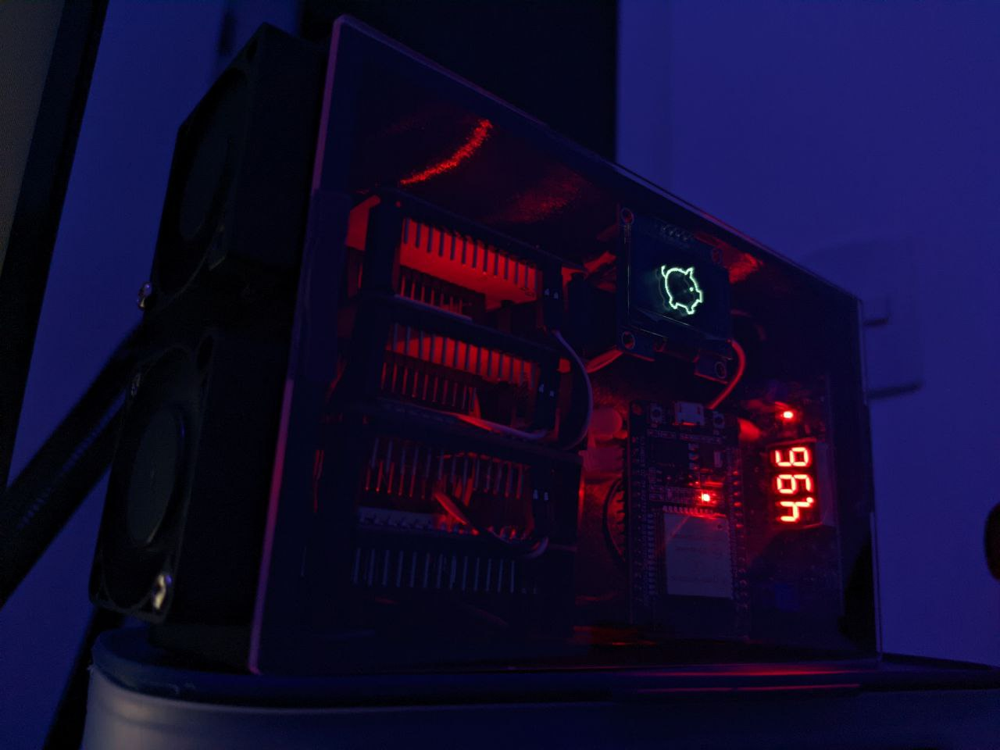

# DuinoCoinRig + Oled Display (SSH1106) + 3D Project

This project is a fun endeavor aimed at creating a [Duino-Coin](https://duinocoin.com/) mining rig utilizing an ESP32 microcontroller and an OLED Display (SSH1106). DuinoCoin, often abbreviated as DUCO, is a cryptocurrency that can be mined using simple devices like Arduino boards, making it an excellent candidate for integration with the ESP32 and an OLED display.

## Project Images

#### 3D Project 

<p class="header" align="center">
 
  
</p>


3D Project in TkinkerCAD: [LINK TO DOWNLOAD AND SEE 3D FILES](https://www.tinkercad.com/things/iTYipCqVdxV-duinocoin-rig-project-)

#### Final Project 

<p class="header" align="center">
 
 
 
</p>

Video: 

[](https://youtu.be/iDpe75lYYbM)

## Startup your Project! 

1. OLED Display Screen Resolution, Change to your OLED display width and height.
```
#define SCREEN_WIDTH 128 // OLED display width, in pixels
#define SCREEN_HEIGHT 64 // OLED display height, in pixels
```

2. OLED I2C ADDRESS
```
#define SCREEN_ADDRESS 0x3C
```
    - use 0x3D if screen resolution 128x64 pixel
    - use 0x3C if screen resolution 128x32 pixel

3. WiFi and Duino User
```
const char *ssid = "YOUR_SSID"; // Change this to your WiFi SSID
const char *password = "YOUR_SSID_PASSWORD"; // Change this to your WiFi password
const String ducoUser = "YOUR_DUINO_USERNAME"; // Change this to your Duino-Coin username
```
# Wiring:
Change SDA and SCL accordingly with your board, this example with Wemos D1 Mini and DevKit V1

|| ESP8266 | ESP32 | OLED |
|:-:| :----: | :----: | :-----: |
||3.3V | 3.3V | VCC |
||GND | GND | GND |
|`SCL`|D1 (GPIO5) | GPIO22| SCL |
|`SDA`|D2 (GPIO4) | GPIO21 | SDA |
